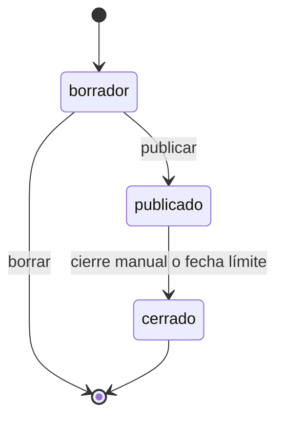

# Eventos

Eventos permite que un organizador publique una selección temporal de productos, comparta un enlace y reciba participaciones independientes. Cada invitado elige variantes, personaliza y registra lo suyo. El pago y la consolidación de producción se conectan sobre esas participaciones.

## Modelo de datos

Todo vive en la tabla única de DynamoDB.

### Evento

- `pk = CUSTOMER#`
- `sk = EVENT#<fecha>-<id>`
- Datos: nombre, descripción, apertura, cierre, dirección completa, estado y código público.
- Contiene de uno a cinco productos del mismo taller. Cada producto es una instantánea con nombre, foto, precio orientativo, tallas y colores.
- Cada producto guarda una regla de personalización:
  - `libre`: el invitado puede editar el diseño base y agregar contenido.
  - `bloqueada`: el diseño base no se puede mover ni borrar; el invitado agrega encima.
  - `sin_personalizacion`: el invitado sólo elige talla, color y cantidad.
- `disenoBase` apunta al JSON editable que creó el organizador. El servidor construye la ruta; el navegador no puede indicar una ruta arbitraria.

### Código público

- `pk = EVENT_CODE#<codigo>`
- `sk = LOCK`
- Resuelve un código opaco al evento y a su organizador.
- Se crea en una transacción al publicar, con condición de unicidad.

### Participación

- `pk = EVENT#<eventoId>`
- `sk = PARTICIPATION#<intentoId>`
- Guarda participante, líneas, variantes, cantidades, precios calculados por el servidor y referencia del diseño.
- `intentoId` hace que repetir una petición del navegador no duplique la participación.
- Una participación es un registro independiente; no es un carrito compartido mutable.

### Diseño temporal de invitado

- `pk = EVENT#<eventoId>`
- `sk = DESIGN#<carritoId>`
- Se crea al firmar la subida y queda ligado a un solo `eventoItemId`.
- Los archivos viven en `eventos/<eventoId>/<eventoItemId>/<carritoId>/...` y caducan junto con el prefijo temporal del bucket.
- Al registrar una participación, el servidor vuelve a comprobar la asociación y que `diseno.json` exista en S3. El navegador no puede reutilizar arte de otro producto ni declarar una ruta propia.

## Estados

El enlace público traduce `publicado` a `proximamente`, `abierto` o `cerrado` según las fechas. Sólo `abierto` acepta diseños y participaciones.

El pago de una participación empieza en `pendiente`. La integración de pago añadirá `pagado`, `fallido` y `reembolsado` mediante webhook. Sólo las participaciones pagadas entrarán al lote de producción.

## API

Rutas con sesión de comprador:

- `GET /cuenta/eventos`
- `POST /cuenta/eventos`
- `GET /cuenta/eventos/:id`
- `PATCH /cuenta/eventos/:id`
- `PATCH /cuenta/eventos/:id/productos/:itemId`
- `POST /cuenta/eventos/:id/publicar`
- `POST /cuenta/eventos/:id/cerrar`
- `DELETE /cuenta/eventos/:id`

Rutas públicas:

- `GET /publico/eventos/:codigo`
- `POST /publico/eventos/:codigo/subidas`
- `POST /publico/eventos/:codigo/participaciones`

La API vuelve a leer cada producto publicado y calcula el precio base. No acepta precios ni rutas completas de arte enviados por el cliente.

## Pantallas y recorrido

1. En **Mi cuenta → Eventos**, el organizador crea el evento, elige fechas, productos y dirección.
2. En el borrador configura cada producto y, si quiere, abre el diseñador para crear una base.
3. Publica y copia el enlace `/evento?codigo=<codigo>`.
4. El invitado abre el enlace sin cuenta, elige productos y entra al mismo diseñador de Kustto.
5. Al guardar, el diseño vuelve al evento y queda asociado al producto elegido.
6. El invitado registra sus datos y selección.
7. La participación aparece inmediatamente en el panel del organizador con piezas, valor y estado de pago.

En personalización bloqueada, las capas de la base se serializan con una marca propia. Al reabrir el diseño sólo esas capas quedan inmóviles; el contenido añadido por el invitado sigue siendo editable. El identificador de intento permanece estable durante el envío, de modo que un reintento de red recupera la misma participación.

La ruta pública usa un parámetro de consulta porque el frontend se exporta como archivos estáticos y no puede generar por adelantado un segmento dinámico para códigos todavía inexistentes.

## Siguiente integración

El siguiente tramo añade una sesión de pago por participación y un webhook idempotente. Al marcar una participación como pagada, el arte pasa del prefijo temporal a almacenamiento de pedido. Al cerrar el evento, un proceso agrupa únicamente participaciones pagadas por producto, variante y técnica, crea el lote de producción del taller y conserva la dirección única del organizador.
